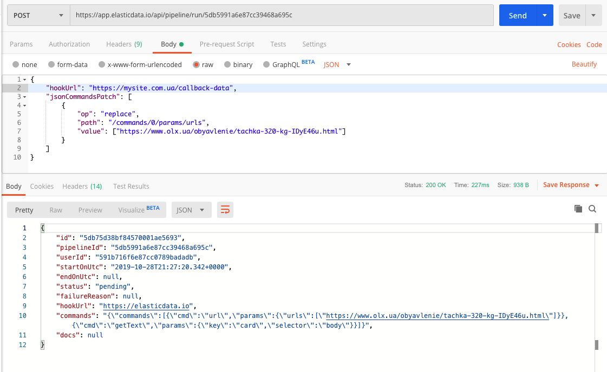

[#api]
== Перелік доступних API викликів

* link:++#run-pipeline++[Запуск павука]
* link:++#task-check++[Перевірка статусу задачі]
* link:++#pipeline-data++[Отримання данних]
* link:++#task-stop++[Зупинка запущеної задачі]

[#run-pipeline]
=== 1. Запуск павука

==== Run. Параметри запуску павука

[cols="h,5a"]
|===
| URL
| domain - `https://app.elasticdata.io` +
path - `/api/pipeline/run/*[pipelineId]*` +
де *[pipelineId]* - id павука, який необхідно запустити

| Method
| POST

| Request Body
| include::dto/PipelineRunDto.adoc[]

| Response Body
| include::dto/PendingApiTaskDto.adoc[]
|===

.Приклад запиту к программі "postman"

IMPORTANT: Після завершення роботи задачі, на hookUrl адресу буде відправлено весь документ зі спарсеними данними.
З http заголовком `Content-Type: application/json`

[#task-check]
=== 2. Перевірка статусу задачі

==== Check task status

[cols="h,5a"]
|===
| URL
| domain - `https://app.elasticdata.io` +
path - `/api/task/status/*[taskId]*` +
де *[taskId]* - `id` задачі яке повернулося в Response Body із попереднього пункту *1. Запуск павука*

| Method
| GET

| Response Body
| include::dto/TaskDto.adoc[]
|===

[#pipeline-data]
=== 3. Отримання данних

Окрім hooks механізму з використанням параметру `hookUrl`, існує додаткова можливість отримати данні напряму через API.

==== Get data. Отримання спарсених данних

[cols="h,5a"]
|===
| URL
| domain - `https://app.elasticdata.io` +
path - `/api/pipeline-task/data/*[taskId]*` +
де *[taskId]* - `id` задачі яке повернулося в Response Body із попереднього пункту *1. Запуск павука*

| Method
| GET

| Response Body
| parsed JSON document
|===

[#task-stop]
=== 4. Зупинка запущеної задачі

==== Stop running task

[cols="h,5a"]
|===
| URL
| domain - `https://app.elasticdata.io` +
path - `/api/task/stop/*[taskId]*` +
де *[taskId]* - `id` задачі яке повернулося в Response Body із попереднього пункту *1. Запуск павука*

| Method
| POST

| Response Body
| include::dto/StoppingApiTaskDto.adoc[]
|===

